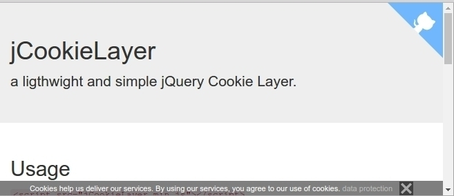

jQuery jCookieLayer
======

[](https://falk-m.de)
[](https://github.com/falkmueller/jQuery.scrollBar)
[](LICENSE)
[](https://falk-m.de)

a ligthwight and simple jQuery Cookie Layer.
[Documentation and Demo](http://code.falk-m.de/jCookieLayer/).



## Usage

```html
 <script type="text/javascript" src="https://ajax.googleapis.com/ajax/libs/jquery/3.2.1/jquery.min.js"></script>
<script src="jCookieLayer.js"></script>
<script>
    jCookieLayer({
        'text': 'Cookies help us deliver our services. By using our services, you agree to our use of cookies.'
    });
</script>
```